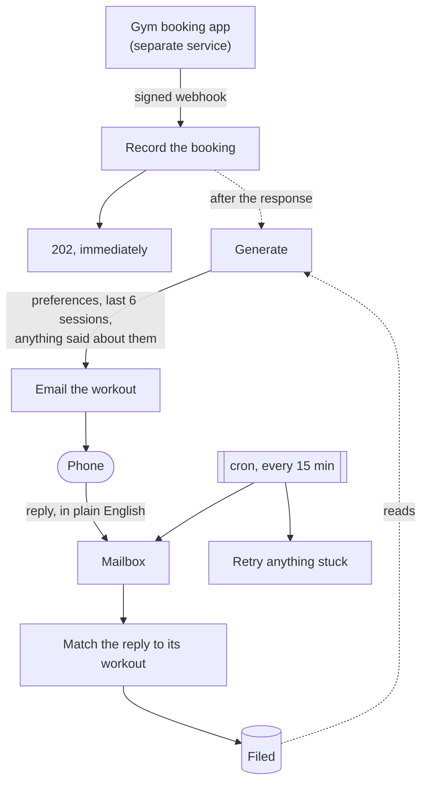

# Workout Loop

Booking a gym slot produces a workout by email. Replying to that email shapes the
next one.



Nothing in that loop needs a person, and no step blocks the one before it.

## The constraint that shapes everything

The phone this is read on **has no web browser**. Email is the only channel it
has.

That is not a detail, it is the design:

- **There is nothing to click.** No links, no dashboards, no "view in browser".
  The email is the entire product.
- **Feedback is a reply**, because a reply is the only interaction email
  supports without a browser.
- **Both message bodies are real.** The HTML one is what the mail client
  renders, so colour separates what is scanned for mid set. The plain text one
  is exact and complete, because it is what any client without HTML falls back
  to.
- **Lines are capped at 50 characters.** A note that wraps on a narrow screen
  turns a two line exercise into four and destroys the layout.

## How it is put together

The interesting logic is pure and tested without a database, a mailbox or an
API key.

| Module | Does | Pure |
|---|---|---|
| `lib/prompt.ts` | Preferences and history in, prompt out | yes |
| `lib/workout-shape.ts` | Recovers structure from a generated plan, so it can be rendered in colour | yes |
| `lib/workout-mail.ts` | Decides what the email says and looks like | yes |
| `lib/reply-parse.ts` | Strips quoted text, reads the threading headers | yes |
| `lib/reply-match.ts` | Decides which workout a reply answers | yes |
| `lib/booking-payload.ts` | Validates what the gym app sends | yes |
| `lib/signature.ts` | HMAC over the webhook body | yes |
| `lib/mailbox.ts` | The one account, both directions | yes |
| `lib/generate.ts` | Calls Claude, or returns a stand in | no |
| `lib/mail-out.ts`, `lib/mail-in.ts` | SMTP and IMAP | no |
| `lib/delivery.ts` | Booked to sent, shared by the webhook and the retry | no |
| `lib/replies.ts` | Polls, matches, files | no |

A few decisions worth knowing:

**Generation happens after the response, not during it.** It takes about thirty
seconds. Booking a gym slot must not wait on that, so the webhook records the
booking, answers `202`, and generates in `after()`. If that work is ever killed
the row stays `pending` and the cron picks it up.

**A retry is not a second code path.** `deliverWorkout` is the same function the
webhook calls, run again. Each step records what it achieved first, so a workout
that generated but failed to send is never generated twice.

**Replies match on the whole thread.** `In-Reply-To` names only the message
immediately before, which is not always the workout. `References` carries the
whole chain. The subject line is the last resort, and an ambiguous subject
matches nothing rather than the likeliest candidate: feedback filed against the
wrong session silently steers the next one.

**Idempotency is in the schema, not in code.** `workouts.booking_ref` and
`feedback.source_message_id` are unique, so a webhook delivered twice inserts
once and a message seen twice files once. Nothing has to remember to check.

## Running it

```bash
npm install
npm test
npm run dev
```

**It runs with nothing configured.** Without an API key the generator returns a
canned plan; without a mailbox, mail prints to the console and the poller does
nothing. The whole loop is exercisable on a laptop with an empty `.env`, which
is the reason it was buildable before any account existed.

```bash
npm run generate:once      # print a workout, with diagnostics
npm run send:once          # generate one and send it
npm run db:migrate         # apply migrations
```

## Configuring it

Copy `.env.example` to `.env`. Nothing in it is required to run; each missing
value degrades to a safe stand in.

| Variable | Without it |
|---|---|
| `DATABASE_URL` | Nothing works. The only hard requirement. |
| `ANTHROPIC_API_KEY` | A canned plan instead of a generated one |
| `MAILBOX_ADDRESS`, `MAILBOX_PASSWORD` | Mail prints to the console, replies are not polled |
| `OWNER_EMAIL` | Nowhere to send, and no address whose replies count |
| `BOOKING_WEBHOOK_SECRET` | Open in development, refused in production |
| `CRON_SECRET` | Open in development, refused in production |
| `BASIC_AUTH_USER`, `BASIC_AUTH_PASSWORD` | Preferences page open in development, refused in production |

One mailbox does both directions. A reply goes back to whoever sent the workout,
so sending and reading have to be the same account for a reply to be findable at
all. For Gmail the password is an App Password, which needs 2FA on that account.

## Deploying

Vercel plus Neon, both on free tiers. The scheduler is GitHub Actions rather
than Vercel Cron, because the free Vercel tier limits cron frequency and Actions
on a public repository does not.

Repository secrets needed by `.github/workflows/cron.yml`:

- `APP_URL`, the deployed origin with no trailing slash
- `CRON_SECRET`, matching the deployment

## Cost

About 80 cents a month at three sessions a week. Generation is roughly six cents
a workout; filing a reply is a database write and costs nothing. Hosting, the
database, mail and the scheduler are all inside free tiers.

Prompt caching is deliberately unused: output is about 80% of every call, so
caching the stable parts would save well under a cent per workout in exchange
for real complexity.

## Tests

```bash
npm test
```

Node's own runner, no framework. The heaviest coverage is on quoted text
stripping, because getting that wrong is silent: an unstripped reply files the
entire previous workout as though it were something the person said, and that
then feeds the next generation.
